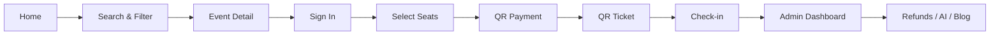

# Beetic — Event Discovery, Ticketing & Operations Platform

**Beetic** is a full-stack web platform that covers the complete event lifecycle: from discovery and seat-based booking, through QR payment and digital tickets, to gate check-in and back-office operations.

Built as a production-grade product—not just an event listing site—Beetic lets users search, filter, reserve seats on an interactive map, pay via bank-transfer QR (SePay), receive QR tickets, and track order status. Administrators manage events, tickets, orders, refunds, blogs, notifications, and AI workflows from a single dashboard.

---

## Table of Contents

1. [Project Overview](#1-project-overview)
2. [Tech Stack](#2-tech-stack)
3. [Key Features](#3-key-features)
4. [Project Structure](#4-project-structure)
5. [Local Setup Guide](#5-local-setup-guide)
6. [Environment Variables](#6-environment-variables)
7. [Available Scripts](#7-available-scripts)
8. [Suggested Demo Flow](#8-suggested-demo-flow)
9. [Demo Accounts](#9-demo-accounts)

---

## 1. Project Overview

### Problem Statement

Event organizers need a unified platform to:

- Promote events and reach attendees.
- Manage seats, ticket types, and inventory in real time.
- Collect payments securely via bank transfer (QR).
- Issue digital tickets with QR codes for gate control.
- Handle refunds, notifications, and content (blogs) in one system.

### The Beetic Solution

Beetic connects the **public experience** and the **admin operations workspace** through a REST API and background processes (queue worker, scheduler).

| User Group | Description |
|---|---|
| **Guests / Attendees** | Discover events, book tickets, pay, view QR tickets, request refunds, read blogs, comment & rate |
| **Administrators** | Manage events, seats, orders, tickets, refunds, users, blogs, AI config, and check-in |
| **System** | Process emails, expire pending orders, send event reminders, generate AI blogs on schedule |

### Highlights

- End-to-end ticketing: select seats → create order → QR payment → issue QR ticket.
- Seat state protection (`available` → `reserving` → `booked`) to reduce double-booking risk.
- **SePay** integration for QR bank-transfer payments and transaction reconciliation.
- QR check-in with valid / duplicate / invalid scan tracking.
- **AI Chat** widget on the public site; admins can take over chat sessions.
- **AI Blog**: generate ideas, draft posts, and configure models/prompts from the admin panel.

---

## 2. Tech Stack

### Frontend (`client/`)

| Technology | Role |
|---|---|
| **React 19** | UI framework |
| **Vite** | Build tool & dev server |
| **Tailwind CSS** | Utility-first styling |
| **Shadcn UI** | Component library (`components/ui/`) |
| **Zustand** | State management (auth, UI, …) |
| **Axios** | HTTP client for API calls |
| React Router | Client-side routing |
| Socket.IO Client | Realtime AI Chat sessions |
| Firebase Client | Google OAuth sign-in |
| TipTap | Rich text editor (admin blog) |
| html5-qrcode | QR scanning for check-in |

### Backend (`server/`)

| Technology | Role |
|---|---|
| **Node.js** | Runtime |
| **Express 5** | REST API framework |
| **TypeScript** | Backend language |
| **Prisma 7** | ORM & migrations |
| **MySQL / MariaDB** | Database |
| Zod | Request validation |
| Socket.IO | Realtime chat |
| Nodemailer | Transactional email |
| PDFKit / QRCode | Ticket PDF & QR generation |
| Node Cron | Scheduled tasks |

### Authentication

- **JWT** — Access token & refresh token.
- **Email verification** — Activation link sent after registration.
- **Forgot password** — Password reset via email.
- **Google sign-in** — Firebase Authentication (optional).

### Payments

- **SePay QR** — Generate bank-transfer QR codes, reconcile transactions via webhook, update order and seat status.

### Artificial Intelligence

| Feature | Description |
|---|---|
| **AI Chat Support** | On-site chat widget; AI auto-replies, admins can switch to manual support |
| **AI Blog** | Generate blog ideas, auto-write posts, configure models & prompts |
| **Scheduled Jobs** | Weekly AI blog generation (Mondays at 08:00) |

> AI is powered by the **Vercel AI SDK** with OpenAI, Google, and Groq providers — model configuration is stored in the database via **AI Blog Config** / **AI Chat Config** admin pages.

---

## 3. Key Features

### 3.1. Public (End User)

| Feature | Description |
|---|---|
| Sign up / Sign in | Email + password or Google account |
| Email verification | Activate account via email link |
| Forgot password | Receive password reset email |
| Home page | Featured and trending events |
| Browse events | Event details, artists, description, seat map |
| Search & filter | By keyword, category, and date |
| Book tickets / select seats | Pick seats on the seat map, fill in details, create order |
| QR payment | Display SePay QR code, track payment status |
| My Tickets | Purchased tickets, QR codes, PDF export |
| Check-in | Ticket page with QR for scanning at the venue |
| Refunds | Submit refund requests from the ticket page |
| Blog | Read articles and browse categories |
| Comments & ratings | Comment and rate on event detail pages |
| AI Chat | On-site support widget (AI + admin handoff) |
| Profile | Account info, orders, saved events |
| Contact | Support request form |

### 3.2. Admin

| Module | Description |
|---|---|
| Dashboard | Revenue stats, orders, charts |
| Events | CRUD events, per-event seats, artists |
| Event categories | Category management |
| Ticket types & default seats | Ticket tiers and seat map templates |
| Orders | Track and manage orders |
| Tickets | Manage issued tickets |
| Payment transactions | SePay transaction history |
| Refunds | Approve / reject refund requests |
| Coupons | Discount code management |
| Check-in | Manual QR scan or ticket code entry |
| Check-in logs | Valid / duplicate / invalid scan history |
| Users | Account management and role assignment |
| Blog & blog categories | Write, edit, and publish articles |
| AI Blog Config | Models and prompts for idea & blog generation |
| AI Chat Config | Model and system prompt for the chatbot |
| AI Chat (Admin) | View and reply to user chat sessions |
| Notifications | System notification center |
| Contacts | Manage messages from the contact form |
| Site settings | Banners and site information |

### 3.3. Core Business Flow

```text
Discover event
       │
Select seats & create order
       │
Seats move to "reserving" state
       │
Generate SePay payment QR
       │
Webhook confirms transaction
       │
Order → Paid | Seats → Booked
       │
Generate tickets with secure QR tokens
       │
Send ticket email (queue worker)
       │
Scan QR at check-in gate
       │
Record: valid / duplicate / invalid
```

---

## 4. Project Structure

```text
eventhub-web-project/
├── client/                          # Frontend — React + Vite
│   ├── public/                      # Static assets (favicon, icons, …)
│   ├── src/
│   │   ├── assets/                  # Images, fonts, media
│   │   ├── components/              # Shared components
│   │   │   ├── ui/                  # Shadcn UI components
│   │   │   └── AIChatWidget/        # AI chat widget (public)
│   │   ├── hooks/                   # Custom React hooks
│   │   ├── layouts/                 # PublicLayout, AuthLayout, AdminLayout
│   │   ├── lib/                     # Axios, Firebase, services, utils
│   │   │   ├── http/                # Axios instance, API error handling
│   │   │   ├── services/            # Domain-specific API services
│   │   │   └── aiChat/              # AI chat session logic
│   │   ├── pages/
│   │   │   ├── (public)/            # User pages: Home, Events, Booking, …
│   │   │   ├── (auth)/              # Login, Register, VerifyEmail, …
│   │   │   └── (admin)/             # Admin pages
│   │   ├── routes/                  # Route guards (auth, admin)
│   │   ├── stores/                  # Zustand stores
│   │   └── styles/                  # Global CSS, admin styles
│   ├── components.json              # Shadcn UI configuration
│   └── package.json
│
├── server/                          # Backend — Express + TypeScript
│   ├── prisma/
│   │   ├── schema.prisma            # Database schema
│   │   ├── migrations/              # Migration files
│   │   └── seed.ts                  # Sample data (ticket types, default seats)
│   ├── src/
│   │   ├── config/                  # Firebase, …
│   │   ├── controllers/             # Request handlers
│   │   ├── jobs/                    # Cron task definitions
│   │   ├── middlewares/             # Auth, validation, upload, error
│   │   ├── queue-jobs/              # Async email & notification jobs
│   │   ├── routes/                  # API route modules
│   │   ├── schema/                  # Zod validation schemas
│   │   ├── services/                # Business logic
│   │   ├── socket/                  # Socket.IO (AI Chat realtime)
│   │   ├── utils/                   # Prisma client, helpers
│   │   ├── index.ts                 # API server entry
│   │   ├── queue.ts                 # Queue worker entry
│   │   └── schedule.ts              # Scheduler entry
│   └── package.json
│
└── README.md
```

### Main API Endpoints

All backend routes are mounted under the `/api` prefix:

```text
/api/auth                  # Register, login, refresh token, email verification
/api/events                # Event CRUD
/api/seats                 # Seat management
/api/orders                # Orders
/api/payment               # SePay QR payment
/api/tickets               # Tickets
/api/check-ins             # Check-in
/api/refunds               # Refunds
/api/blogs                 # Blog
/api/comments              # Comments & ratings
/api/ai-chat               # AI Chat
/api/blog-ideas            # AI blog ideas
/api/ai-content-config     # AI configuration
/api/admin/dashboard       # Admin statistics
/api/notifications         # Notifications
```

Uploaded files are served at `/uploads`.

---

## 5. Local Setup Guide

### Prerequisites

| Component | Suggested Version |
|---|---|
| Node.js | 18+ (20 LTS recommended) |
| npm | 9+ |
| MySQL or MariaDB | 8.0+ / 10.6+ |

**External services (depending on features to demo):**

- Firebase project — Google sign-in
- SePay account — QR payments
- SMTP mailbox — verification emails, tickets, reminders
- AI provider API key — OpenAI / Google / Groq (for AI Chat & Blog)

### Step 1 — Clone the repository

```bash
git clone <repository-url>
cd eventhub-web-project
```

### Step 2 — Install dependencies

```bash
# Backend
cd server
npm install

# Frontend
cd ../client
npm install
```

### Step 3 — Create the database

Create an empty MySQL database, for example:

```sql
CREATE DATABASE beetic CHARACTER SET utf8mb4 COLLATE utf8mb4_unicode_ci;
```

### Step 4 — Configure environment variables

Create `server/.env` and `client/.env.development` using the templates in [Section 6](#6-environment-variables).

### Step 5 — Initialize the database

```bash
cd server
npm run prisma:generate
npm run prisma:migrate
npm run prisma:seed
```

The `prisma:seed` command creates sample data: VIP/Standard ticket types and a 5-row × 10-seat default seat map.

### Step 6 — Run the project

Open **4 separate terminals**:

```bash
# Terminal 1 — API Server (port 8000)
cd server
npm run dev

# Terminal 2 — Queue Worker (async email processing)
cd server
npm run queue:dev

# Terminal 3 — Scheduler (order expiry, reminders, AI blog)
cd server
npm run schedule:dev

# Terminal 4 — Frontend (port 5173)
cd client
npm run dev
```

Access points:

| Service | URL |
|---|---|
| Website | http://localhost:5173 |
| API | http://localhost:8000/api |
| Prisma Studio | `npm run prisma:studio` (inside `server/`) |

> **Note:** In development, all 4 processes (API, Queue, Scheduler, Frontend) must run concurrently for emails, pending order expiration, and scheduled tasks to work correctly.

---

## 6. Environment Variables

> **Do not commit real `.env` files to Git.** The values below are placeholders only.

### `server/.env`

```env
# Server
PORT=8000
NODE_ENV=development
FRONTEND_URL=http://localhost:5173

# Database (MySQL / MariaDB)
DATABASE_HOST=localhost
DATABASE_USER=root
DATABASE_PASSWORD=your_database_password
DATABASE_NAME=beetic

# JWT
ACCESS_TOKEN_SECRET=your_access_token_secret_min_32_chars
REFRESH_TOKEN_SECRET=your_refresh_token_secret_min_32_chars
ACCESS_TOKEN_EXPIRES_IN=15m
REFRESH_TOKEN_EXPIRES_IN=7d

# Email (SMTP)
MAIL_HOST=smtp.gmail.com
MAIL_PORT=587
MAIL_USER=your_email@example.com
MAIL_PASS=your_mail_app_password

# Firebase Admin (Google sign-in)
FIREBASE_PROJECT_ID=your_firebase_project_id
FIREBASE_CLIENT_EMAIL=your_firebase_client_email
FIREBASE_PRIVATE_KEY="your_private_key_with_escaped_newlines"

# SePay — QR Payment
SEPAY_BANK_CODE=your_bank_code
SEPAY_ACCOUNT_NUMBER=your_account_number
SEPAY_ACCOUNT_NAME=YOUR ACCOUNT NAME

# AI Provider (detailed model config via Admin → AI Config)
# API key is set according to the provider chosen in the AI SDK
OPENAI_API_KEY=your_openai_api_key
```

### `client/.env.development`

```env
# API Backend
VITE_API_URL=http://localhost:8000

# Firebase Client (Google sign-in)
VITE_FIREBASE_API_KEY=your_firebase_api_key
VITE_FIREBASE_AUTH_DOMAIN=your_project.firebaseapp.com
VITE_FIREBASE_PROJECT_ID=your_firebase_project_id
VITE_FIREBASE_STORAGE_BUCKET=your_project.appspot.com
VITE_FIREBASE_MESSAGING_SENDER_ID=your_sender_id
VITE_FIREBASE_APP_ID=your_firebase_app_id
VITE_FIREBASE_MEASUREMENT_ID=your_measurement_id
```

---

## 7. Available Scripts

### Frontend (`client/`)

| Command | Description |
|---|---|
| `npm run dev` | Start Vite dev server (http://localhost:5173) |
| `npm run build` | Production build |
| `npm run preview` | Preview production build |
| `npm run lint` | Run ESLint |
| `npm run format` | Format code with Prettier |

### Backend (`server/`)

| Command | Description |
|---|---|
| `npm run dev` | Start API server (hot reload) |
| `npm run queue:dev` | Start queue worker (development) |
| `npm run schedule:dev` | Start scheduler (development) |
| `npm run build` | Compile TypeScript → `dist/` |
| `npm run start` | Run API in production (`dist/index.js`) |
| `npm run start:queue` | Run queue worker in production |
| `npm run start:schedule` | Run scheduler in production |
| `npm run prisma:generate` | Generate Prisma Client |
| `npm run prisma:migrate` | Run migrations (development) |
| `npm run prisma:deploy` | Deploy migrations (production) |
| `npm run prisma:seed` | Seed sample data |
| `npm run prisma:studio` | Open Prisma Studio |
| `npm run prisma:reset` | Reset database (warning — deletes all data) |

---

## 8. Suggested Demo Flow

The scenario below covers the full business flow and is suitable for a graduation presentation (~15–20 minutes).

### Part A — User Experience (8–10 min)

| # | Step | Action | Talking Point |
|---|---|---|---|
| 1 | Discover | Open home page → go to **Events** | Modern UI, featured events |
| 2 | Search | Use search bar, filter by **category** and **date** | Multi-criteria filters |
| 3 | Event detail | Open an event → view description, artists, comments | Community: comments & ratings |
| 4 | Register | **Sign up** for a new account → check verification email | JWT + email verification |
| 5 | Sign in | Log in after verification (or via Google) | Complete auth flow |
| 6 | Book tickets | Select seats on the **seat map** → fill in details → create order | Realtime seat state changes |
| 7 | Payment | **QR Payment** page — display SePay code | Payment gateway integration |
| 8 | Receive ticket | After payment → **My Tickets** → view QR code | Digital ticket, PDF export |
| 9 | AI Chat | Open the chat widget, ask a question | AI auto-support |
| 10 | Blog | Read a blog post | Content & SEO layer |

### Part B — Operations & Admin (7–10 min)

| # | Step | Action | Talking Point |
|---|---|---|---|
| 11 | Dashboard | Sign in as **Admin** → view statistics | Revenue charts, overview |
| 12 | Event management | Create / edit an event, configure seats | Full CRUD |
| 13 | Orders & tickets | View the order just created, ticket status | Transaction traceability |
| 14 | Check-in | Go to **Check-in** → scan ticket QR | Valid / duplicate scan tracking |
| 15 | Refunds | Demo refund request (user) → approve (admin) | Refund workflow |
| 16 | AI Blog Config | View model/prompt config, generate blog idea | Generative AI integration |
| 17 | AI Chat Admin | Open a chat session, reply to a user | AI → human handoff |
| 18 | Notifications | Check the notification center | Notification system |

### Demo Overview Diagram



---

## 9. Demo Accounts

> Demo accounts must be created manually after setup, or added to `server/prisma/seed.ts`. Replace the placeholders below with real credentials before the demo session.

| Role | Email | Password | Notes |
|---|---|---|---|
| Administrator | `admin@beetic.demo` | `Admin@123456` | Access `/admin` |
| User | `user@beetic.demo` | `User@123456` | Ticket booking flow |
| Check-in staff | `staff@beetic.demo` | `Staff@123456` | Check-in permissions (if applicable) |

**Quick way to create an admin account:**

1. Register an account via `/register`.
2. Verify the email (or update directly in the database).
3. In Prisma Studio or SQL, set `role = ADMIN` for the corresponding user.

---

## Development Notes

- **Security:** Never put real secrets (JWT, Firebase, SMTP, SePay, AI keys) in source code or this README.
- **Separate processes:** The API, Queue Worker, and Scheduler serve different roles — run them in parallel during development.
- **Critical logic:** Seat, payment, and QR ticket code is the most sensitive part of the system — test thoroughly before demo day.
- **Production:** Use `npm run build` + `npm run start` (and `start:queue`, `start:schedule`) for the backend; `npm run build` for the frontend.

---

## Authors

Graduation Project — **Beetic Platform**

*End-to-end event platform: Discover → Book → Pay → Check-in → Operate.*
